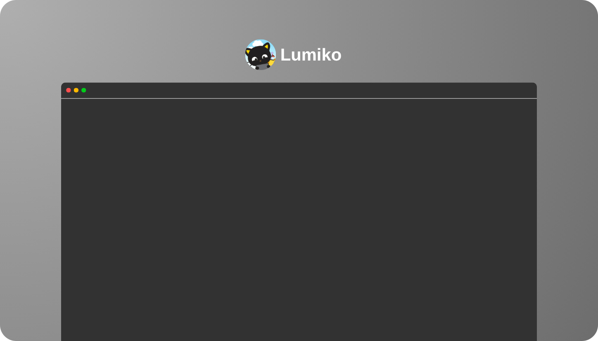

    

        <a href="https://passportdex.com/lumiko"> More about me </a>
        <a>•</a>
        <a href="https://github.com/lumikin"> Github Acadêmico </a>
    

<h2>Skills</h2>

 <h3> <strong>Linguagens</strong> </h3>
        
        <h3><strong>Frameworks (Backend/Frontend)</strong></h3>
        
        <h3> <strong> Banco de dados </strong> </h3>
        
        </a>
        <h3><strong>Ferramentas</strong></h3>
        
        <h3><strong>Sistemas Operacionais</strong></h3>
        

 

  <h1> Projetos em Destaque </h1>
   

  <table border="0">
    <tr>
      <td width="50%" align="left">
        <h3><strong>Nao tem :(</strong></h3>
        
TBA

        
      </td>
      <td width="50%" align="center">
        
      </td>
    </tr>
  </table>

   
      </td>
    </tr>
  </table>

